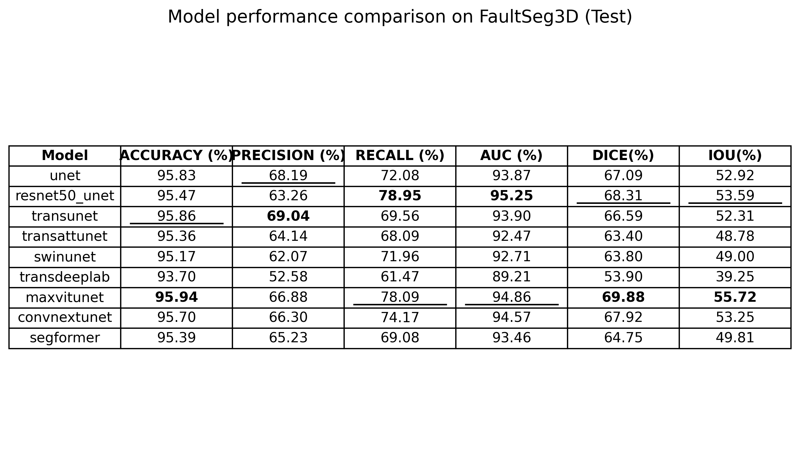
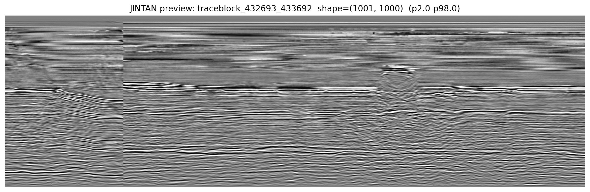
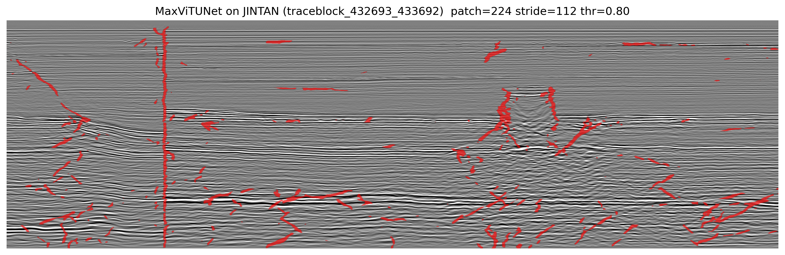

# FaultSeg3D & Beyond: Deep Learning for 3D Seismic Fault Segmentation


Official repository for our 3D seismic fault segmentation research. We benchmark 9 SOTA architectures on the public **FaultSeg3D** dataset and successfully deploy the best-performing model (**MaxViTUNet**) on a highly noisy, real-world commercial dataset (JINTAN, Sarawak Basin).

---

## 🏆 Results

### 1. FaultSeg3D Benchmark
We evaluated 9 models (U-Net, ResNet50_UNet, ConvNeXtUNet, TransUNet, SwinUNet, SegFormer, TransDeepLab, MaxViTUNet, and a custom TransAttUNet). 

**MaxViTUNet** achieved SOTA performance with **69.88% DICE** and **55.72% IoU**.




### 2. Real-World Deployment (JINTAN Oilfield)
Applied directly to a commercial `.sgy` dataset with severe geological noise using sliding-window inference (`thr=0.80`).

| Raw Seismic Cross-Section | MaxViTUNet Prediction |
| :---: | :---: |
|  |  |

---

## 🚀 Quick Start

### 1. Installation
```bash
git clone [https://github.com/4322565133-boop/deep-learning-fault-detection.git](https://github.com/4322565133-boop/deep-learning-fault-detection.git)
cd deep-learning-fault-detection

python -m venv .venv
source .venv/bin/activate

pip install -U pip
pip install -r requirements.txt
```

### 2. Data Prep
Place the `FaultSeg3D` `.dat` volumes here:
```text
data/wangjing/
├── train/seis/ & train/fault/
└── validation/seis/ & validation/fault/
```

### 3. Train & Benchmark
Train a specific model or run the full 9-model benchmark:
```bash
# Train one model
python train_faultseg3d.py --config configs/maxvitunet.yaml

# Run full benchmark pipeline
python benchmark_all.py
```

### 4. Inference on Custom SEGY Data
Run sliding-window inference on your own `.sgy` files:
```bash
python JINTAN/infer_jintan_models.py \
    --sgy /path/to/your/seismic.sgy \
    --start 432693 --block 1000 --thr 0.80
```